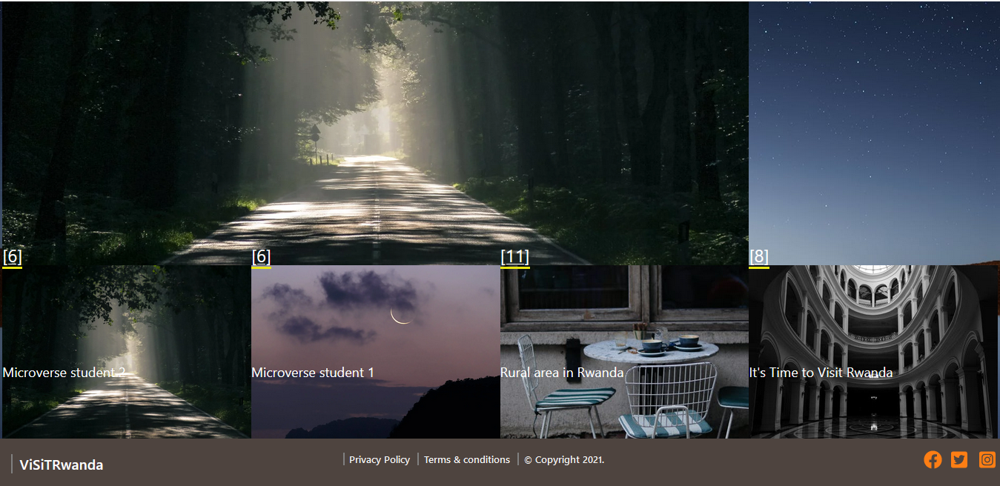
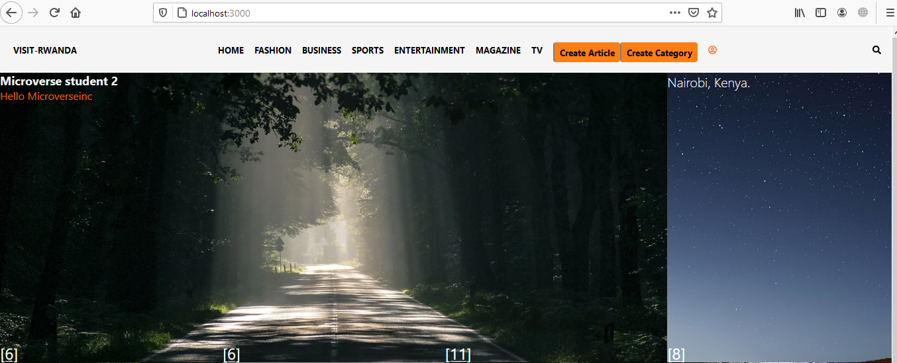

# LiFesTylE

> LiFesTylE is the most popular web app to write - read articles as well as vote about the latest the bal and cycling shows. Simply log in to your account and start exploring.  This project consists of a simple session system with login and sign-up functionalities. You'll be redirected to the homepage where all categories will be displayed together with the most recent article written in that category. You can click the category section to browse all articles inside a single category. I also implemented a voting system for the articles where the user can vote just once for each article.

## Features

- User can log in only using the username
- User sees the homepage where the first row is the most voted article followed by all categories - listed with the most recent article's image and title
- Only logged in user can submit an article
- When the user clicks on a category inside the homepage, they can see all articles in that category
- Users can vote only once for each article.


## Live Demo

TBA

### Screenshot of the homepage






## Getting Started

To get a local copy up and running follow these simple example steps:


## Built With

* Ruby v2.7.2
* Ruby on Rails v6.1.3.2
* Postgres: >=13.2-2
* SQLite3
* Node.js
* Yarn


### Setup and Install

* Open your terminal - Windows: `Win + R`, then type `cmd` | Mac: `Command + space`, then type `Terminal`
* Navigate to a directory of your choosing using the `cd` command
* Run this command in your OS terminal: `https://github.com/Emmyn5600/Lifestyle.git` to get a copy of the project
* Navigate to the project's directory using the `cd` command
* Migrate the database to your environment by running `rails db:migrate`
* Run `rails webpacker:install` to configure Webpacker for your environment. Otherwise, an error like `Webpacker::Manifest::MissingEntryError` will appear if you attempt to run the server.
* Install dependencies by running `bundle install`* Execute `rails server` to fire up the server
* Visit `http://localhost:3000/` in your browser to get into the app
* Interact with the app using the links in the nav bar. To access private pages, sign up by clicking the `Sign Up` link
* Interact with the app
* To close the server, enter `Ctrl + C` in your terminal

### Setup

Instal gems with:

```
bundle install
```

Setup database with:

```
   rails db:create
   rails db:migrate
```

### Github Actions

To make sure the linters' checks using Github Actions work properly, you should follow the next steps:

1. On your recently forked repo, enable the GitHub Actions in the Actions tab.
2. Create the `feature/branch` and push.
3. Start working on your milestone as usual.
4. Open a PR from the `feature/branch` when your work is done.

### Usage

Start server with:

```
    rails server
```

Open `http://localhost:3000/` in your browser.

### Run tests

```
    bundle exec rspec
```

👤 **NSABIMANA Emmanuel**

- GitHub: [@emmyn5600](https://github.com/Emmyn5600)
- Twitter: [@NSABIMA62253884](https://twitter.com/NSABIMA62253884)
- LinkedIn: [@nsabimana-emmanuel-4276091b2](https://www.linkedin.com/in/nsabimana-emmanuel-4276091b2/)

## Credits

Thanks to [Nelson Sakwa](https://www.behance.net/sakwadesignstudio) for her awesome design work. I based my work on  [this](https://www.behance.net/gallery/14554909/liFEsTlye-Mobile-version) design.

## 🤝 Contributing

Contributions, issues, and feature requests are welcome!

Feel free to check the [https://github.com/Emmyn5600/Lifestyle/issues](issues/).